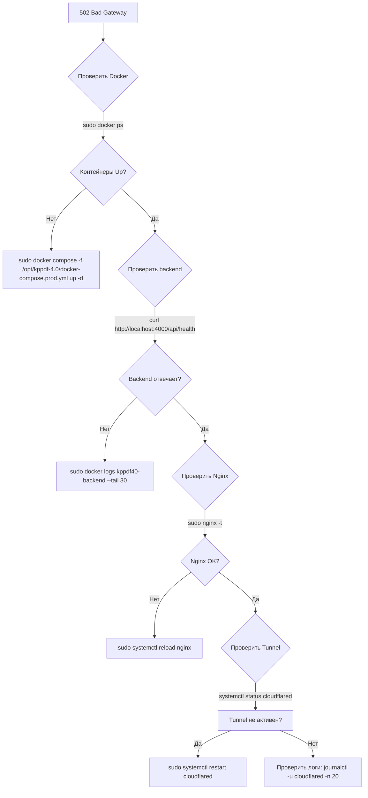

# KPPDF 4.0 — RUNBOOK (инструкция по работе с сервером)

> **Для кого:** человек (администратор, разработчик)
> **Цель:** чёткий порядок действий для подключения, обновления, деплоя и аварийного восстановления
> **Сервер:** `192.168.1.46` — Ubuntu 24.04 LTS, VM на Synology NAS
> **Домен:** `https://sport-set.ru` (через Cloudflare Tunnel)
>
> **См. также:** [DEPLOY.md](DEPLOY.md) — инструкция по деплою · [ЧЕК-ЛИСТ-КОНСОЛИДИРОВАННЫЙ.md](ЧЕК-ЛИСТ-КОНСОЛИДИРОВАННЫЙ.md) — общий чек-лист проекта

---

## 📋 Содержание

1. [Быстрый доступ](#1-быстрый-доступ)
2. [Архитектура](#2-архитектура)
3. [Структура на сервере](#3-структура-на-сервере)
4. [Ежедневные операции](#4-ежедневные-операции)
5. [Деплой новой версии](#5-деплой-новой-версии)
6. [Обновление пакетов ОС](#6-обновление-пакетов-ос)
7. [Проверка работоспособности](#7-проверка-работоспособности)
8. [Аварийные процедуры](#8-аварийные-процедуры)
9. [Что НЕЛЬЗЯ делать](#9-что-нельзя-делать)
10. [Шпаргалка команд](#10-шпаргалка-команд)

---

## 1. Быстрый доступ

### SSH-подключение

```bash
ssh tiit@192.168.1.46
# Пароль: узнайте у администратора (в deploy/config.env)
```

### Параметры входа

| Параметр | Значение |
|----------|----------|
| IP | `192.168.1.46` (внутренняя сеть) |
| Пользователь | `tiit` |
| Пароль | в `deploy/config.env` (файл в `.gitignore`) |
| ОС | Ubuntu 24.04.4 LTS |
| Ресурсы | 1.92 TB диск (использовано 0.6%), 18% RAM |

### Cloudflare Tunnel

Туннель автоматически поднимается через `systemd`:
```bash
sudo systemctl status cloudflared     # статус туннеля
sudo systemctl restart cloudflared    # перезапуск
```

---

## 2. Архитектура

```
[Пользователь]
      │
      ▼
[Cloudflare] ─── DNS: sport-set.ru → Cloudflare IP
      │
      ▼
[Cloudflare Tunnel] ─── cloudflared service на сервере
      │
      ▼
[Nginx :80] ─── /etc/nginx/sites-enabled/kppdf
      │
      ├── / → /opt/kppdf-4.0/frontend/ (Angular SPA)
      │
      └── /api/ → http://127.0.0.1:4000 (backend)
                            │
                            ▼
                    ┌── kppdf40-backend :4000
                    │   (Express + tsx, порт 3000 внутри)
                    │
                    └── kppdf40-mongodb :27018
                        (MongoDB 4.4, порт 27017 внутри)
                        bind-mount: /var/lib/kppdf40/mongodb/
```

### Компоненты на сервере

| Компонент | Путь / Контейнер | Важность |
|-----------|-----------------|----------|
| 🔴 Код приложения | `/opt/kppdf-4.0/` | Перезаписывается при деплое |
| 🟢 База данных | `/var/lib/kppdf40/mongodb/` | 🔥 **СОХРАНЯЕТСЯ** |
| 🟢 Загруженные файлы | `/var/lib/kppdf40/media/` | 🔥 **СОХРАНЯЕТСЯ** |
| 🟡 Nginx конфиг | `/etc/nginx/sites-enabled/kppdf` | Копируется из проекта |
| 🟡 Cloudflare Tunnel | `/etc/systemd/system/cloudflared.service` | Системная служба |

> 🔴 = можно перезаписывать · 🟡 = редко менять · 🟢 = **НЕ ТРОГАТЬ**

---

## 3. Структура на сервере

### `/opt/kppdf-4.0/` — код приложения

```
/opt/kppdf-4.0/
├── .env                        # Production JWT-ключи (секрет!)
├── backend/
│   ├── Dockerfile
│   ├── .env.production         # Копия из .env для Docker
│   ├── package.json
│   └── src/                    # Исходники TypeScript
├── frontend/                   # Собранный Angular (SPA)
│   └── index.html
├── shared/                     # Общие типы (TypeScript)
├── deploy/                     # Скрипты деплоя
│   └── deploy.sh
├── docker-compose.prod.yml     # Production Docker Compose
└── ...                         # Прочие файлы (package.json и т.д.)
```

### `/var/lib/kppdf40/` — **ДАННЫЕ (не трогать!)**

```
/var/lib/kppdf40/
├── mongodb/     # 🟢 База MongoDB — живёт вечно
├── media/       # 🟢 Загруженные пользователями файлы
└── chromadb/    # 🟡 ChromaDB (пока не используется на сервере)
```

### Docker контейнеры

| Контейнер | Статус | Порт на хосте | Логи |
|-----------|--------|---------------|------|
| `kppdf40-backend` | healthy | `4000` | `sudo docker logs kppdf40-backend` |
| `kppdf40-mongodb` | healthy | `27018` (127.0.0.1) | `sudo docker logs kppdf40-mongodb` |
| `kppdf40-chromadb` | unhealthy | `8000` (127.0.0.1) | `sudo docker logs kppdf40-chromadb` |

> ChromaDB пока не используется на сервере — запущена для совместимости, её статус unhealthy не критичен.

---

## 4. Ежедневные операции

### Проверить что сайт работает

```bash
# С любого компьютера
curl -sf https://sport-set.ru/api/health

# Должен ответить: {"status":"ok","timestamp":"..."}
```

### Проверить контейнеры

```bash
ssh tiit@192.168.1.46
sudo docker ps
# Все контейнеры должны быть "Up" и "healthy"
```

### Посмотреть логи

```bash
# Backend (последние 50 строк)
sudo docker logs kppdf40-backend --tail 50

# MongDB
sudo docker logs kppdf40-mongodb --tail 20

# Следить за логами в реальном времени
sudo docker logs kppdf40-backend -f
```

### Перезапустить один контейнер

```bash
sudo docker restart kppdf40-backend
```

> ⚠️ После рестарта подождите 10-15 секунд, пока backend перезапустится.

---

## 5. Деплой новой версии

### Полный деплой (сборка + загрузка)

```bash
# На своём ПК (Windows), из корня проекта:
cd C:\Users\user\WebstormProjects\kppdf-4.0

# Убедиться что deploy/config.env заполнен
# Запустить деплой:
bash deploy/deploy.sh

# Или с флагами:
bash deploy/deploy.sh --skip-build   # если Angular уже собран
bash deploy/deploy.sh --skip-seed    # если seed уже был
```

### Что делает скрипт деплоя

```
Шаг 1: Сборка Angular (npm run build)
Шаг 2: Создание архива kppdf40-deploy.tar.gz
Шаг 3: Загрузка на сервер через SCP
Шаг 4: На сервере:
  1/5 → Распаковка архива в /opt/kppdf-4.0/
  2/5 → Настройка .env с production-ключами
  3/5 → Docker сборка и запуск контейнеров
  4/5 → Ожидание готовности backend
  5/5 → Проверка health-check
```

### Ручной деплой (если что-то пошло не так)

```bash
# 1. Собрать архив вручную
cd /c/Users/user/WebstormProjects/kppdf-4.0
tar czf /tmp/kppdf40-manual.tar.gz \
  --exclude='backend/node_modules' \
  --exclude='.git' \
  backend/ shared/ dist/browser/ deploy/deploy.sh docker-compose.prod.yml

# 2. Загрузить на сервер
scp /tmp/kppdf40-manual.tar.gz tiit@192.168.1.46:/tmp/

# 3. На сервере распаковать и запустить
ssh tiit@192.168.1.46
sudo bash /opt/kppdf-4.0/deploy/deploy.sh /tmp/kppdf40-manual.tar.gz
```

### Быстрое обновление одного файла (без пересборки)

Если нужно поправить только backend-код:

```bash
# На своём ПК
scp backend/src/index.ts tiit@192.168.1.46:/tmp/

# На сервере
ssh tiit@192.168.1.46
sudo cp /tmp/index.ts /opt/kppdf-4.0/backend/src/index.ts
sudo docker restart kppdf40-backend
```

> ⚠️ Это временное решение. После полного деплоя файл перезапишется.

---

## 6. Обновление пакетов ОС

**Когда:** При входе в систему, если есть уведомление `7 обновлений может быть применено`

```bash
ssh tiit@192.168.1.46

# Обновить список пакетов и установить обновления
sudo apt update && sudo apt upgrade -y

# Удалить ненужные пакеты
sudo apt autoremove -y

# Если было обновление ядра — перезагрузить сервер
sudo reboot
```

> ⚠️ После `sudo reboot` подождите 1-2 минуты. Docker поднимет контейнеры автоматически.
> Cloudflare Tunnel может переподключаться до 30 секунд.

---

## 7. Проверка работоспособности

### Чек-лист после любого изменения

```bash
# 1. Контейнеры работают?
sudo docker ps
# Ожидается: 3 контейнера Up, backend — healthy

# 2. Backend отвечает?
curl -sf http://localhost:4000/api/health
# Ожидается: {"status":"ok","timestamp":"..."}

# 3. Nginx настроен?
sudo nginx -t
# Ожидается: syntax is ok

# 4. Nginx работает?
curl -sf http://localhost:80/api/health
# Ожидается: {"status":"ok","timestamp":"..."}

# 5. Cloudflare Tunnel активен?
systemctl is-active cloudflared
# Ожидается: active

# 6. Сайт доступен через интернет? (с любого ПК)
curl -sf https://sport-set.ru/api/health
# Ожидается: {"status":"ok","timestamp":"..."}

# 7. Фронтенд отдаётся?
curl -s -o /dev/null -w "%{http_code}" https://sport-set.ru/
# Ожидается: 200

# 8. Логин работает?
curl -sf -X POST https://sport-set.ru/api/v1/auth/login \
  -H "Content-Type: application/json" \
  -d '{"username":"admin","password":"admin123"}'
# Ожидается: JWT-токен (длинная строка)
```

### Все проверки одной командой

```bash
# С сервера
echo "=== Docker ===" && sudo docker ps --format "table {{.Names}}\t{{.Status}}" && echo "=== Backend ===" && curl -sf http://localhost:4000/api/health && echo "" && echo "=== Nginx ===" && sudo nginx -t 2>&1 && echo "=== Tunnel ===" && systemctl is-active cloudflared && echo "=== Frontend ===" && curl -s -o /dev/null -w "HTTP %{http_code}" http://localhost:80/

# Снаружи (с любого ПК)
echo "=== Health ===" && curl -sf https://sport-set.ru/api/health && echo "" && echo "=== Frontend ===" && curl -s -o /dev/null -w "HTTP %{http_code}" https://sport-set.ru/ && echo "" && echo "=== Login ===" && curl -sf -X POST https://sport-set.ru/api/v1/auth/login -H "Content-Type: application/json" -d '{"username":"admin","password":"admin123"}' -w "\nHTTP %{http_code}" -o /dev/null
```

---

## 8. Аварийные процедуры

### 🆘 Сайт не открывается (502 Bad Gateway)



### 🆘 Не могу зайти по SSH

```bash
# 1. Проверить что сервер включен (через Synology DSM)
# 2. Проверить сеть: ping 192.168.1.46
# 3. Если ping есть, но SSH нет — возможно firewall
# 4. Зайти через Synology DSM → Virtual Machine Manager → консоль VM
```

### 🆘 База данных повреждена

```bash
# Остановить backend (чтобы не писал в БД)
sudo docker stop kppdf40-backend

# Проверить целостность MongoDB
sudo docker exec kppdf40-mongodb mongod --repair --dbpath /data/db

# Если не помогает — восстановить из бэкапа (TODO: настроить бэкапы)
# Пока бэкапов нет — будьте осторожны!
```

### 🆘 Закончилось место на диске

```bash
# Проверить сколько места занято
df -h

# Самые большие папки
sudo du -sh /var/lib/kppdf40/*

# Очистить Docker (неиспользуемые образы, контейнеры)
sudo docker system prune -f

# Очистить логи
sudo journalctl --vacuum-time=7d
```

---

## 9. Что НЕЛЬЗЯ делать

| ❌ Действие | Почему |
|-------------|--------|
| `sudo rm -rf /var/lib/kppdf40/mongodb/` | Удалит ВСЮ БАЗУ ДАННЫХ |
| `sudo docker compose down -v` | Флаг `-v` удалит volumes (данные MongoDB) |
| Менять `docker-compose.prod.yml` на сервере вручную | При следующем деплое файл перезапишется |
| Писать пароль в `deploy/config.env.example` | Пример попадает в git |
| Запускать `git push` с секретами в коде | JWT-ключи утекут в публичный репозиторий |
| `sudo systemctl disable cloudflared` | Сайт станет недоступен из интернета |
| Удалять старый проект `/opt/kppdf-3.0/` | Пока не убедились что 4.0 полностью стабилен |
| `sudo apt upgrade` без `sudo apt update` сначала | Может сломать зависимости |

---

## 10. Шпаргалка команд

### Быстрые команды (копировать и вставить)

```bash
# ─── SSH ───
ssh tiit@192.168.1.46

# ─── Docker ───
sudo docker ps                          # список контейнеров
sudo docker logs kppdf40-backend -f     # логи backend (live)
sudo docker logs kppdf40-mongodb --tail 20  # последние строки MongoDB
sudo docker restart kppdf40-backend     # перезапустить backend
sudo docker compose -f /opt/kppdf-4.0/docker-compose.prod.yml down  # остановить всё
sudo docker compose -f /opt/kppdf-4.0/docker-compose.prod.yml up -d # запустить всё
sudo docker system prune -f             # очистка мусора

# ─── Nginx ───
sudo nginx -t                           # проверить конфиг
sudo systemctl reload nginx             # перезагрузить
sudo systemctl restart nginx            # перезапустить

# ─── Cloudflare Tunnel ───
systemctl is-active cloudflared         # статус
sudo systemctl restart cloudflared      # перезапустить
sudo journalctl -u cloudflared -n 20    # логи

# ─── Система ───
sudo apt update && sudo apt upgrade -y  # обновить пакеты
sudo apt autoremove -y                  # удалить ненужное
sudo reboot                             # перезагрузка
df -h                                   # свободное место
free -h                                 # свободная RAM
htop                                    # мониторинг (если установлен)

# ─── Проверка ───
curl -sf http://localhost:4000/api/health                    # backend напрямую
curl -sf http://localhost:80/api/health                      # через Nginx
curl -sf https://sport-set.ru/api/health                     # через интернет
curl -sf -X POST https://sport-set.ru/api/v1/auth/login \
  -H "Content-Type: application/json" \
  -d '{"username":"admin","password":"admin123"}'             # логин
```

---

## Приложение: изменения конфигурации

Если нужно изменить порты, домен или добавить сервис:

1. Правите файлы **локально** в проекте (не на сервере!)
2. Деплоите через `bash deploy/deploy.sh`
3. Если изменился Nginx — обновите `deploy/nginx-kppdf40.conf`

**Никогда не правите конфиги на сервере вручную** — они перезапишутся при деплое.

---

## История изменений

| Дата | Автор | Изменение |
|------|-------|-----------|
| 2026-06-08 | Buffy | Первая версия RUNBOOK |
| 2026-06-08 | Buffy | Чек-лист деплоя, аварийные процедуры |
